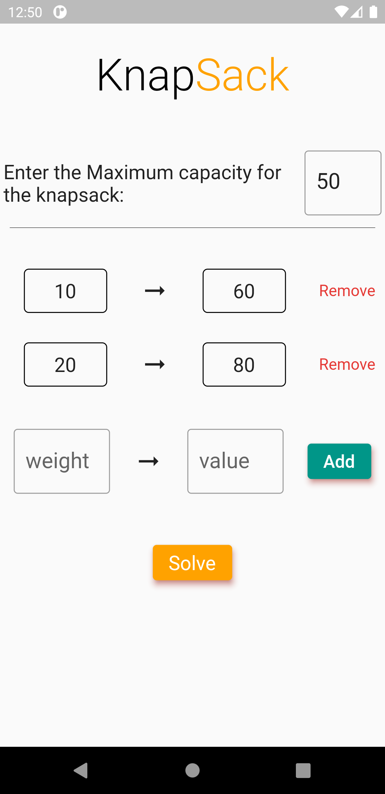

# Knapsack Problem

### Task for Tenner | Flutter Application ~ Mohit Sharma

### About the problem : :

The knapsack problem is a combination optimization problem. Given a set of items, each with a weight value, determine how many of each item to include in the collection so that the total weight is below the specified limit, and the sum is as large as possible. Its name derives from the problem faced by someone who is constrained to a fixed-size backpack and must be filled with the most valuable items. This problem often arises in resource allocation where decision makers have to choose each from a set of projects or tasks that cannot be divided under fixed budgets or time constraints.

### Algorithm Used : :

```dart
int max(int a, int b) {
    return (a > b) ? a : b;
}
int knapSack(List<int> wt, List<int> val, int cap, int size) {
	**//if capicity is zero**
	if (size == 0 || cap == 0) return 0;

	**//if weight exceeds the capacity, no addition**
	if (wt[size - 1] > cap)
	  return knapSack(wt, val, cap, size - 1);

	**//else taking the max of (with element, without element)**
	else
	  return max(
	      val[size - 1] + knapSack(wt, val, cap - wt[size - 1], size - 1),
	      knapSack(wt, val, cap, size - 1));
}
```

---

### Flutter App : :



**Functionalities:**

_To input_

1. Maximum Capacity
2. Weights and their values

**Features :**

1. Error Handling & Displaying on empty inputs
2. Dynamic Addition of input fields.
3. Swipe right to remove added inputs.


**Functionalities:**

_To Display_

1. Total Value of items stored in knapsack
2. Percentage utilization of weight of the bag

### APK File : :

_Google Drive Link :_
[https://drive.google.com/file/d/17lmnxlv5CnilQJeddMG6gDNFE0QUJXIY/view?usp=sharing](https://drive.google.com/file/d/17lmnxlv5CnilQJeddMG6gDNFE0QUJXIY/view?usp=sharing)
